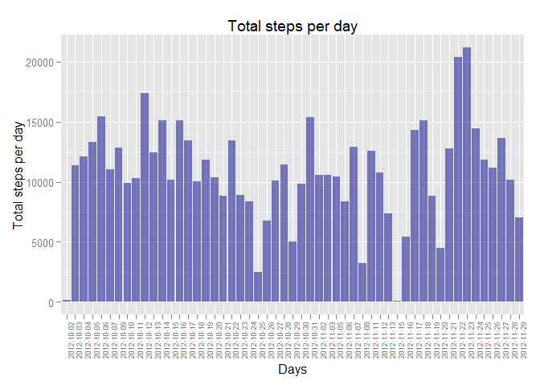
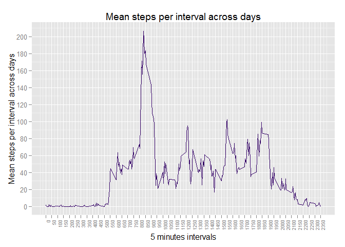
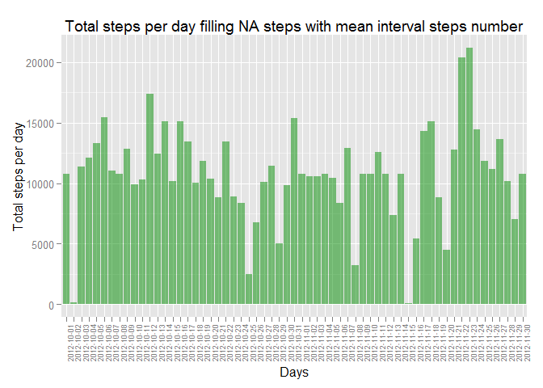
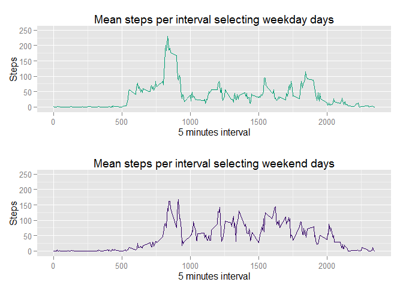

# Reproducible Research: Peer Assessment 1
*by Marco De Agostini, October 2014*


## *Introduction*
The document has the aim to show the analysis required by Peer Assignment 1 of
*Coursera Reproducible Research* course project.The analysis computes data from
a personal activity monitoring device. 
The original data set comes from: 

https://d396qusza40orc.cloudfront.net/repdata%2Fdata%2Factivity.zip

and it consists of two months of data from an anonymous individual collected 
during the months of October and November, 2012 and it includes the number of 
steps taken in 5 minute intervals each day.

In the following step by step the details about the analysis: from the
loading processing procedure to the final findings.


## *Loading and preprocessing the data*
First of all, to performe the analysis, it is necessary to obtain the original 
data: checking if the *Activity.csv* required file is available, 
downloading and unpacking the remote archive file otherwise. 
Finally the sourcing data set is loaded.


```r
## Check sourcing file
## if no file is found, remote archive file is downloaded and unzipped
if (!file.exists("activity.csv")) { 
        fileUrl <- "https://d396qusza40orc.cloudfront.net/repdata%2Fdata%2Factivity.zip"
        download.file(fileUrl, destfile = "activity.zip", method="curl")
        unzip("activity.zip")           
}
## Reading sourcing file, na character set to "NA"
Data <- read.table("activity.csv", sep = ",", header = TRUE, na.strings = "NA")
```

The loaded data set looks like:


```r
totalRow <- nrow(Data)
head(Data)
```

```
##   steps       date interval
## 1    NA 2012-10-01        0
## 2    NA 2012-10-01        5
## 3    NA 2012-10-01       10
## 4    NA 2012-10-01       15
## 5    NA 2012-10-01       20
## 6    NA 2012-10-01       25
```

It contains 17568 rows and the variables:

* **steps**: Number of steps taking in a 5-minute interval (missing values are coded as NA)
* **date**: The date on which the measurement was taken in YYYY-MM-DD format
* **interval**: Identifier for the 5-minute interval in which measurement was taken

A new data set containing only the not NA steps in then computed.

```r
## Creating Data set without NA step values
DataNotNA <- Data[!is.na(Data$steps),]
head(DataNotNA)
```

```
##     steps       date interval
## 289     0 2012-10-02        0
## 290     0 2012-10-02        5
## 291     0 2012-10-02       10
## 292     0 2012-10-02       15
## 293     0 2012-10-02       20
## 294     0 2012-10-02       25
```

## *What is mean total number of steps taken per day?*
The mean and median of total number of steps taken per day are obtained 
using the not-NA-step dataframe, calculating the sum of total step for each day 
(see graph below) and finally computing the mean and the median along all the days.


```r
## Loading plyr library, summerizing steps for each date on DataNotNA dataframe
library(plyr)
SumStepsDataNotNA <-ddply(DataNotNA,.(date),summarize,TotalStepsPerDay=sum(steps))

## Plotting total step means for each day
library(ggplot2)
ggplot(SumStepsDataNotNA, aes(x=date, y=TotalStepsPerDay)) + 
        geom_bar(stat="identity", position=position_dodge(),
                 fill = "blue4", 
                 alpha = .5) +
        xlab("Days") +
        ylab("Total steps per day") +
        ggtitle("Total steps per day") +
        theme(axis.text.x = element_text(size = 7,angle = 90, hjust = 1))
```

 

```r
## Calculating number of days, mean and median
NumDayNotNA <- nrow(SumStepsDataNotNA)
MeanTotalStepPerDay <- mean(SumStepsDataNotNA$TotalStepsPerDay)
MedianTotalStepPerDay <- median(SumStepsDataNotNA$TotalStepsPerDay)
```

Considering the 53 days with not-NA-steps, the mean of total 
steps per day is:

```r
MeanTotalStepPerDay
```

```
## [1] 10766
```

while the median is:

```r
MedianTotalStepPerDay
```

```
## [1] 10765
```

## *What is the average daily activity pattern?*
The average daily activity pattern is computed calculating the average number
of steps for each interval across all the days, then plotting an interval / average
total number of steps graph.

The elaboration of the average number of steps for each interval across all the days:


```r
## Computing Mean Step per each interval across all days 
## and identifying the max mean steps interval
MeanStepPerIntervalNotNA <-ddply(DataNotNA,
                                 .(interval),
                                 summarize,
                                 MeanStepPerInterval=mean(steps))
```

The dataframe with average number of steps looks like:


```r
totalRowAD <- nrow(MeanStepPerIntervalNotNA)
head(MeanStepPerIntervalNotNA)
```

```
##   interval MeanStepPerInterval
## 1        0             1.71698
## 2        5             0.33962
## 3       10             0.13208
## 4       15             0.15094
## 5       20             0.07547
## 6       25             2.09434
```

and it contains 288 rows (one for each 5-minutes interval in a day).

The time series plot of the 5-minute interval (x-axis) and the average number of
steps taken, averaged across all days (y-axis)


```r
## Time series plot of the 5-minute interval (x-axis) 
## and the average number of steps taken, averaged across all days (y-axis)
library(scales)
ggplot(MeanStepPerIntervalNotNA, aes(x=interval, y=MeanStepPerInterval)) +
        scale_x_continuous(breaks = 
                                  round(
                                          seq(min(MeanStepPerIntervalNotNA$interval), 
                                          max(MeanStepPerIntervalNotNA$interval),
                                          by = 50),1)) +
        scale_y_continuous(breaks = 
                                   round(
                                           seq(min(MeanStepPerIntervalNotNA$MeanStepPerInterval), 
                                               max(MeanStepPerIntervalNotNA$MeanStepPerInterval),
                                               by = 20),1)) +
        geom_line(colour = "#330066") +
        xlab("5 minutes intervals") +
        ylab("Mean steps per interval across days") +
        ggtitle("Mean steps per interval across days") +
        theme(legend.position="none") +
        theme(axis.text.x = element_text(size = 7,angle = 90, hjust = 1))
```

 

The interval with the maximum number of step is:

```r
MaxStepPerIntervalNotNa <- max(MeanStepPerIntervalNotNA$MeanStepPerInterval)
IntervalMaxStepNotNA <- 
        MeanStepPerIntervalNotNA[MeanStepPerIntervalNotNA$MeanStepPerInterval == 
                                         MaxStepPerIntervalNotNa,1]
IntervalMaxStepNotNA
```

```
## [1] 835
```

## *Imputing missing values*
The original data set contains many rows with NA-data for the *step* variable.
Below an evaluation of the impacts of the NA-data step presence.

First the count of NA-step rows; the NA-step rows are:

```r
## Calculating the total number of missing values in the dataset 
DataNA <- Data[is.na(Data$steps),]
TotalNumbMissingValues <- nrow(DataNA)
TotalNumbMissingValues
```

```
## [1] 2304
```

Then a new data set is calculated, filling the NA-step data. The strategy
adopted to fill the NA-step data consists into replace the NA values with the 
mean total step number for the associated 5-minute interval.


```r
## Joining the dataframe "Data" containing all the observations and mean 
## step per interval dataframe; the ipothesis is that for
## each day at the same hour an indvidual does the same activity
DataMeanStepPerInterval <- join(Data, MeanStepPerIntervalNotNA, by = "interval") 

## Replacing NA steps with mean step for interval
DataMeanStepPerInterval[is.na(DataMeanStepPerInterval$steps),1] <-
        (DataMeanStepPerInterval[is.na(DataMeanStepPerInterval$steps),4])
```

Below an exaple of NA-step data, from the original data

```r
DataNA[1,]
```

```
##   steps       date interval
## 1    NA 2012-10-01        0
```

And the same observtion after the filling strategy has been applied

```r
DataMeanStepPerInterval[DataMeanStepPerInterval$date %in% DataNA[1,2] & 
                        DataMeanStepPerInterval$interval %in% DataNA[1,3]
                        ,1:3]
```

```
##   steps       date interval
## 1 1.717 2012-10-01        0
```

The sum of total steps for each, the mean and median of total steps are calculated

```r
## Calculating sum steps for each day using step filled dataframe
SumDataMeanStepPerInterval <-ddply(DataMeanStepPerInterval,
                                   .(date),
                                   summarize,
                                   TotalStepsPerDay=sum(steps))

MeanTotalStepPerDayNAFilled <- mean(SumDataMeanStepPerInterval$TotalStepsPerDay)
MedianTotalStepPerDayNAFilled <- median(SumDataMeanStepPerInterval$TotalStepsPerDay)
```

The graph of the total number of steps taken each day is shown below:

```r
## Plotting total steps per day using step filled dataframe
ggplot(SumDataMeanStepPerInterval, aes(x=date, y=TotalStepsPerDay)) + 
        geom_bar(stat="identity", position=position_dodge(),fill = "green4", alpha = .5) +
        xlab("Days") +
        ylab("Total steps per day") +
        ggtitle("Total steps per day filling NA steps with mean interval steps number") +
        theme(axis.text.x = element_text(size = 7,angle = 90, hjust = 1))
```

 

The mean of total steps numer calculated using the filled-NA step dataset is:

```r
MeanTotalStepPerDayNAFilled
```

```
## [1] 10766
```

While the median is:

```r
MedianTotalStepPerDayNAFilled
```

```
## [1] 10766
```

Elaboration of some "metric" reported in final findings:

```r
## Percentage of NA records
NaRecPerc <- round((TotalNumbMissingValues / totalRow) * 100)
## Calculating the difference between the mean of total steps per day computed with 
## NA filled dataframe and NA escluded dataframe
DeltaMeanTotalSteps <- round(MeanTotalStepPerDayNAFilled - MeanTotalStepPerDay)
## Calculating the difference between the median of total steps per day computed with 
## NA filled dataframe and NA escluded dataframe
DeltaMedianTotalSteps <- round(MedianTotalStepPerDayNAFilled - MedianTotalStepPerDay)
```

Final findings:

* The NA-steps records represent the 13% of total records
* The impact on the elaboration of the mean total steps number across all days 
is not relevant (difference is equal to 0 days)
* The impact on the elaboration of the median total steps number across all days 
is not relevant (difference is equal to 1 day)


## *Are there differences in activity patterns between weekdays and weekends?*
Using the filled NA-step data set, the activity pattern of the individual
during the weekdays and weekend days is analyzed.

First a factor variable is added to the data set to distinguish weekdays and
weekend days


```r
## Changig local settings to obtain english week-days
Sys.setlocale("LC_TIME", "English")
```

```
## [1] "English_United States.1252"
```

```r
DataMeanStepPerInterval$date <- as.Date(DataMeanStepPerInterval$date)
## Building weekday and weekend sets
weekend <- c("Saturday","Sunday")
## Adding new factor variable daytype with values "weekday" (default) 
## or "weekend" (if "Saturday" or "Sunday")
DataMeanStepPerInterval$daytype <- "weekday"
DataMeanStepPerInterval[weekdays(DataMeanStepPerInterval$date) %in% weekend,]$daytype <- "weekend"
```

Then weekday and weekend days activity patterns are plotted and compared

```r
MeanStepPerIntervalweekday <-ddply(
        DataMeanStepPerInterval[DataMeanStepPerInterval$daytype == "weekday",],
        .(interval),
        summarize,
        MeanStepPerInterval=mean(steps))

MeanStepPerIntervalweekend <-ddply(
        DataMeanStepPerInterval[DataMeanStepPerInterval$daytype == "weekend",],
        .(interval),
        summarize,
        MeanStepPerInterval=mean(steps))

## Time series plots of the 5-minute interval 
## and the average number of steps taken, averaged across 
## weekday days (plotweekday) and weekend days (plotweekend)
library(gridExtra)
```

```
## Loading required package: grid
```

```r
plotweekday <- ggplot(MeanStepPerIntervalweekday, aes(x=interval, y=MeanStepPerInterval)) + 
        geom_line(colour = "#009E73") +
        xlab("5 minutes interval") +
        ylab("Steps") +
        ggtitle("Mean steps per interval selecting weekday days") +
        theme(legend.position="none") +
        scale_y_continuous(limits=c(-5, 250))

plotweekend <- ggplot(MeanStepPerIntervalweekend, aes(x=interval, y=MeanStepPerInterval)) + 
        geom_line(colour = "#330066") +
        xlab("5 minutes interval") +
        ylab("Steps") +
        ggtitle("Mean steps per interval selecting weekend days") +
        theme(legend.position="none") +
        scale_y_continuous(limits=c(-5, 250))

grid.arrange (plotweekday, plotweekend, nrow = 2, ncol=1)
```

 

By means of a qualitative analysis of the individual activity pattern, the major findings obtained by the comparison of weekday and weekend days behavior are:

* the weekdays steps peak seems to be higher than the weekend days steps peak, and
* the subject seems start moving later in the weekend days (more then 50 steps only after the 800 interval), but
* the subject seems make more movements in the weekends day (the average of total steps is higher during the range of intervals 800 - 2000)
